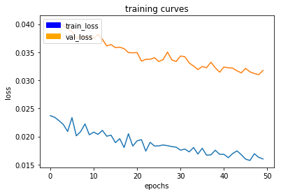
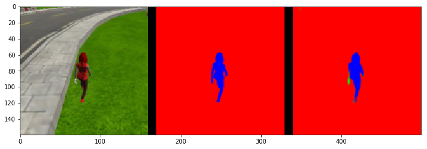
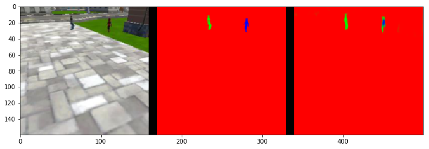
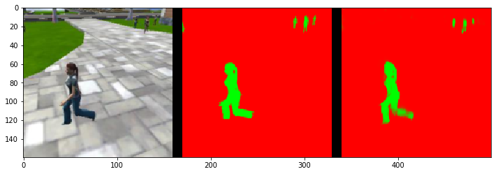

**Project Follow Me**

This readme describes the architecture of my network to follow a target in the udacity simulator. The content is the following:

* Network Layer Definition
* Model Architecture
* Network Training
* Prediction performance
* Network Performance Evaluation
* Framework

---
###README

With my [project code](https://github.com/markusbrn/RoboNDFollowMeP1.git) I am performing the following steps:

###Network Layer Definition
In this section the different layers of the network are defined. In detail the following layers are used:

  * separable_conv2d_batchnorm: This means that a separable convolution layer is followed by a batch normalization layer. For the separable convolution a normal convolution is performed on each channel of the input. With a kernel size of e.g. 3x3 this gives 36 filter parameters (for 4 input channels). The 4 feature maps that are the result of the channelwise convolution are then traversed by n filters with kernel size 1 to give n output channels. In the case of 9 output channels this would mean 36 additional parameters. The reason to use separable convolutions is the reduced number of parameters when compared to 2d convolutions. With batch normalization the output of the serapable convolutions layer is rescaled so that it has a mean of 0 and a standard deviation close to 1.
  * conv2d_batchnorm: This means that a classical 2d convolution layer is followed by a batch normalization layer. With the example from above (input channels: 4, filter kernel size: 3, output channel size: 9) this means a number of 4x3x3x9=324 tunable parameters.
  * Maxpooling: With maxpooling the resolution of the feature map can be reduced (simultaneously the translation invariance is increased). This is done by applying a filter kernel that selects only the largest number of the current patch while sliding over a feature map. If a stride of e.g. 2 is chosen the feature map can be reduced in size by factor 1/2.
  * Bilinear Upsample: This layer is used in the decoder part of the network to upsample the input feature maps (that have been reduced in resolution by maxpooling in the encoder).

###Model Architecture
The final network then has a structure similar to FCN (only with much less down- and upsampling blocks.

One block of the encoder consists of a separable_conv2d_batchnorm layer followed by a Maxpooling layer.

One decoder block consists of a bilinear upsampling layer which is then concatenated with the layer of the encoder that has the same resolution (width x height). According to [1] this is done in order to refine the spatial precision of the output. A separable_conv2d_batchnorm layer is finally applied to the concatenated output.

The resulting model has 3 encoder and 3 decoder blocks:

| Layer         		|     Description                                    |
|:---------------------:|:--------------------------------------------------:|
| Input                 | 160x160x3 rgb image		                         |
| Encoder Block 1     	| 32 output feature maps                             |
| Encoder Block 2     	| 64 output feature maps                             |
| Encoder Block 3     	| 128 output feature maps                            |
| conv2d_batchnorm    	| kernel_size 1x1, 64 output feature maps, stride 1  |
| Decoder Block 3     	| concatenated with Enc2, 128 output feature maps    |
| Decoder Block 2     	| concatenated with Enc1, 64 output feature maps     |
| Decoder Block 1     	| concatenated with Input, 32 output feature maps    |
| Conv2D            	| 3 output classes, softmax activation               |

By using a 1x1 convolution layer as frontend for the encoder part the spatial resolution of the network is preserved and thus semantic segmentation is possible. If a fully connected layer were to be used instead the spatial resolution would be lost.
The Decoder Block 1 of the network is finally convolved with three 3x3x32 kernels to give the three output classes. By using the softmax activation function for this layer the probability of a pixel belonging to a certain class can be computed.

###Network Training

To train the model, I am using a batch size of 20, and train for 50 epochs (with 200 training batches used per epoch). The used learning rate is 0.0001. The loss during training and validation can be seen in the following figure:

As can be seen from the figure even after 50 epochs a decrease in training and validation loss can be observed. Especially the validation loss is of interest here as it gives an indication that no excessive overfitting of the network to the training data has occurred after the 50 epochs. As input only the data provided with the udacity project github repository was used. By using additional data that can be recorded with the simulator the network performance might be improved even further.

###Inference performance
For testing the inference performance the code from the udacity github project is used.

From left to right each figure shows the camera image that is used as input to the network, the ground truth and the result from the inference with the network. In the upmost figure the target is close to the camera position, in the middle figure the target is far from the camera position and in the last figure the target cannot be seen in the camera frame. As can be seen from the figures the network performs very well when the target is close to the camera and still is able to detect some pixels when the target is far from the camera.

If the network should be able to identify another object instead of the target person (a dog e.g.) this should certainly be possible - provided enough labeled training data exists. In the case of retraining the network it might make sense to keep the weights that were learned while training to track the person as especially the filters on the lower layers might make sense to detect other objects as well.

###Network Performance Evaluation
When using the IoU metric (code is provided in the udacity project repo) the network achieves an accuracy of 51.9%.

###Framework
In order to use my graphics card I had to switch to tensorflow 1.9 (as tensorflow 1.2.1 requires an older cudnn version than the one on installed on my computer). Therefore I had to adapt some of the files from the utils folder in order to work with the newer tensorflow version. However - as the training process was much faster I think the change has paid off.
Unfortunately the *model_tools.save_network* function then did not work for me. Therefore I used the *save_model* function directly from keras to save the whole network (in hdf-format). To load the network  (e.g. for inference in *follower.py*) I am using the function *load_network1* which I defined in *model_tools.py*.

[1] Long, Shelhamer, Darrell: Fully Convolutional Networks for Semantic Segmentation

